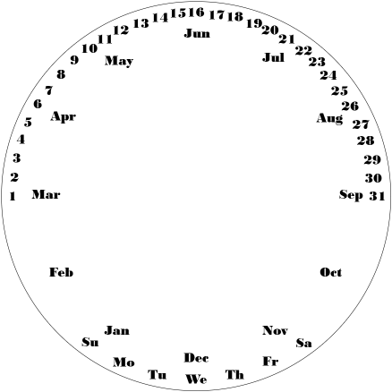

# Date clock

This date clock aims to modify an existing analog quartz wall clock to render the date with its hands.

As clocks have three hands, a date clock allows for the rendering of three date properties:

* `hours` now displays the current month.
* `minutes` now displays the current day of the month.
* `seconds` now displays the current day of the week.

As weeks tend to start on either Sunday or Monday, dependent on the country,
this date clock uses day 0-6, where the meaning is entirely dependent on the face plate.